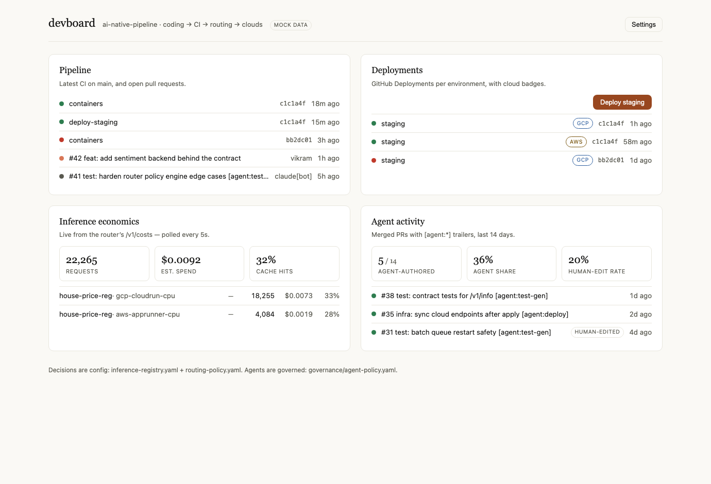
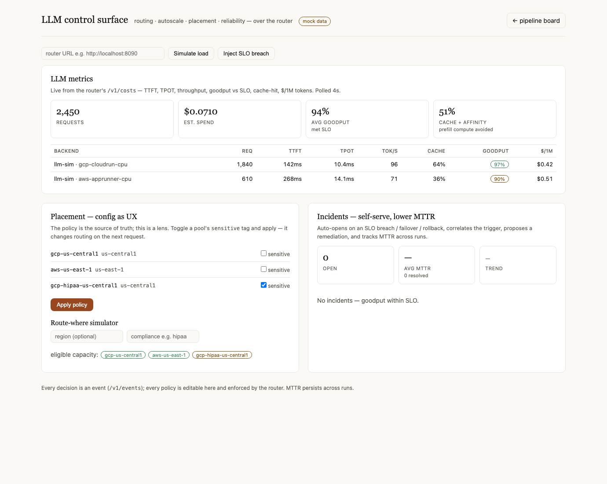

# devboard

A single-file developer dashboard over the pipeline: CI runs, deployments,
inference economics (live from the router's `/v1/costs`), and agent activity.
React via CDN, zero build step, zero backend — it talks straight to the
GitHub API and the router.



## Setup (3 lines)

```bash
python3 -m http.server 8400 --directory tools/devboard   # serve it
open "http://localhost:8400/?mock=true"                  # tour with mock data
# live data: Settings → owner/repo + a PAT (repo+actions scopes) + router URL
```

The PAT lives in memory only — never localStorage; a refresh forgets it.
The "Deploy staging" button fires `deploy-staging.yml` via workflow_dispatch;
its confirm dialog quotes the exact governance policy line being invoked.
Lighthouse accessibility: 100 (see repo history for the run).

## LLM control surface (`llm.html`, Phase 10)

A second zero-backend page over the router's `/v1/costs`, `/v1/events`,
`/v1/policy`, and `/v1/simulate` — linked from the pipeline board.



```bash
python3 -m http.server 8400 --directory tools/devboard
open "http://localhost:8400/llm.html?mock=true"   # renders with no router
# live: paste the router URL (e.g. http://localhost:8090) in the toolbar
```

Three panels:
- **LLM metrics** — TTFT, TPOT, tokens/sec, goodput vs SLO, cache-hit, $/1M
  tokens per backend, and the prefill compute the cache+affinity avoided.
- **Placement (config-as-UX)** — the placement policy as an editable lens;
  toggling a pool's `sensitive` tag and applying changes routing on the next
  request (POSTs `/v1/policy/placement`). A live **route-where simulator**
  shows eligible capacity for a hypothetical region/compliance request.
- **Incidents** — auto-opens on an `slo_breach` / failover / rollback event,
  correlates the trigger, proposes a remediation, and tracks **MTTR** as a
  trend persisted across runs. "Inject SLO breach" demonstrates the flow with
  no backend. Lighthouse accessibility: 100.
